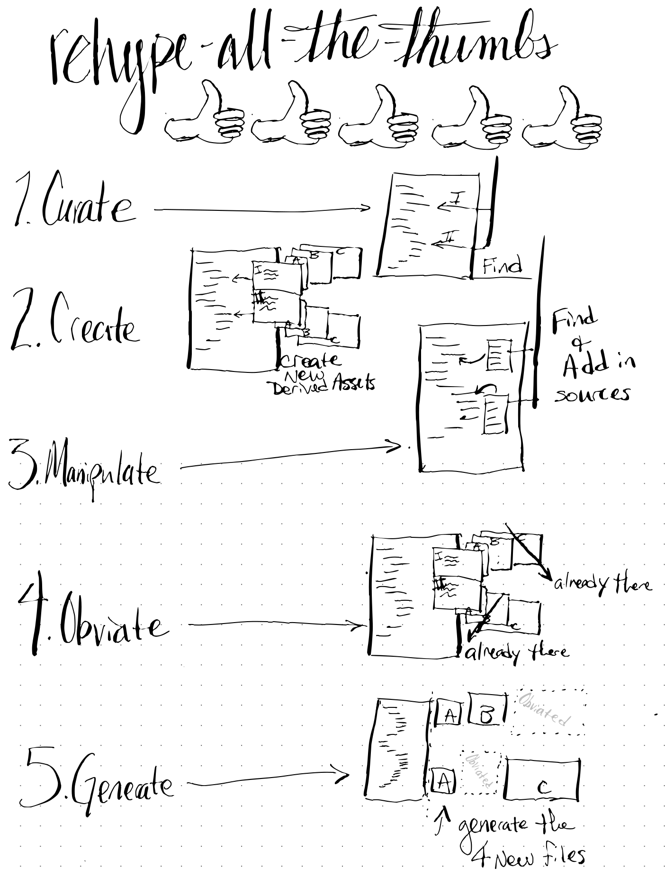

# rehype-all-the-thumbs

> rehype-👍🏿👍🏼👍🏽👍🏻👍🏾

`rehype-all-the-thumbs` is a unifiedjs/rehypejs plugin that finds images in your DOM, and makes thumbnail images automatically. It also ships with defaults so you can get started with no config and get reaasonable results, and it also offers extensive config options to meet various needs.

`rehype-all-the-thumbs` comes with:
- a default config
- options to set a user default in the unified processor
- options to set configuration for each node in the DOM individullly
- options on where to save/emit these images.

## Behind the Scenes 

`rehype-all-the-thumbs` is actually a unified preset that composes smaller plugins together... and those other plugins are available for develoeprs should you have a need similar to the solution those aim to solve.

The Following are Nominated for Best Supporting Plugins in RehypeAllTheTumbs:

- [rehype-all-the-thumbs-curate](https://github.com/ericdmoore/rehype-all-the-thumbs-curate) (DOM -> data.srcs)
- [rehype-all-the-thumbs-create](https://github.com/ericdmoore/rehype-all-the-thumbs-create) (data.srcs -> data.newAssets)
- [rehype-all-the-thumbs-manipulate](https://github.com/ericdmoore/rehype-all-the-thumbs-manipulate) (data.newAssets -> DOM)
- [rehype-all-the-thumbs-obviate](https://github.com/ericdmoore/rehype-all-the-thumbs-obviate) (data.newAssets.filter -> data.newAssets)
- [vfile-newAssets-generate](https://github.com/ericdmoore/vfile-newAssets-generate) (data.newAssets -> Side Effect Funtion to create the file)

## Clarification

If you are using one of the "...ate" plugins, and you are not making a preset, or developing other plugins, if you "Just  want some thumbnails to show up", you should jump up one level and use the main plugin `rehype-all-the-thumbs`

> rehype-👍🏿👍🏼👍🏽👍🏻👍🏾 (main plugin)

## License

[MIT][license] © [Eric D Moore][author]

<!-- Definitions -->

[license]: LICENSE

[author]: https://im.ericdmoore.com